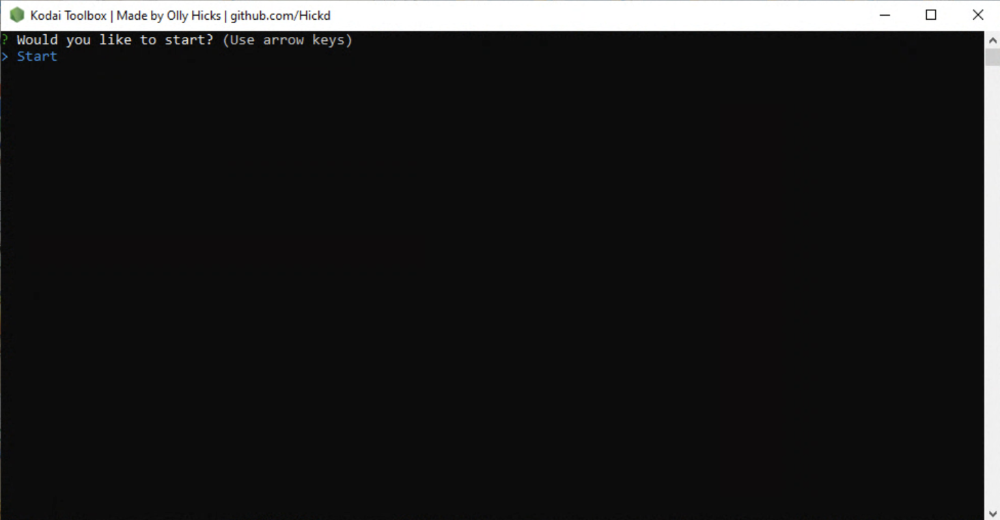

# kodai-toolbox-uk

Here is a toolbox to help with the tedious parts of setting up Kodai to bot Nike.
As a lot of account generating softwares output account email, password, firstname and lastname into seperate CSV columns, this tool allows you to format this information correctly to enter into a Kodai profile CSV and import profiles easily.
This tool also will remove '+44' from the start of UK mobile phone numbers for easy import into Kodai profiles CSV and will format Nike accounts for you how you desire so you can easily paste them into Kodai.

* GUIDE *

A CSV template (profiles.csv) and accounts.txt template are provided on this github page. Download these along with kodai-toolbox.exe and put them all in the same folder.

To format accounts:

1. Enter account email and password into the correct columns of profiles.csv

2. Enter your account config as desired (check Kodai guides for the different types of format) e.g. imap_email:imap_password:imap_domain:port

3. Make sure to NOT add a colon (:) at the start of the ACC_CONFIG as the tool does this for you

4. Open the exe and select 'Start' and your accounts will be formatted and outputted to the 'accounts.txt' file!

To format UK mobile numbers and first and last names:

1. Enter the required details into 'profiles.csv'

2. Open the exe and select 'Start'

3. The tool will create a csv file in your folder containing the full names and formatted phone numbers

